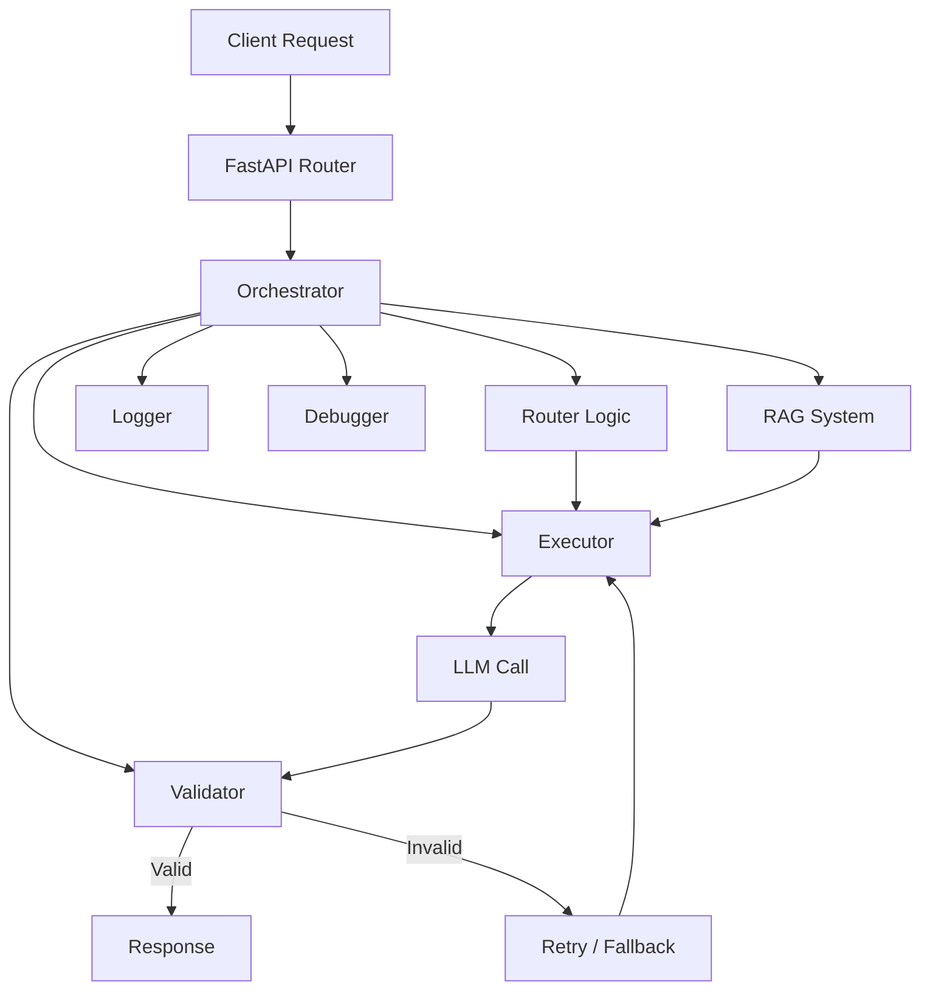

# LLM Sentinel

## LLM Orchestrator with Validation and Fallback

**Production-oriented LLM orchestration system** built with FastAPI that coordinates multiple components like routing, validation, execution, fallback handling, and retrieval-augmented generation (RAG).

The system is designed to:

* Dynamically route tasks based on intent
* Execute LLM-driven workflows with retries and fallbacks
* Validate outputs against strict production constraints
* Augment responses using a FAISS-backed retrieval system
* Log and debug failures systematically

It addresses real-world issues such as:

* Partial or empty responses
* Inconsistent retry logic
* Missing fallback handling
* Non-production-grade outputs

---

## 🧠 Models Used

### 🔹 Local Models (Ollama)

* `qwen2.5-coder:7b` → Code generation & debugging
* `mistral:7b` → General-purpose tasks
* `llama3.2:3b` → Lightweight fallback (general/code)

### 🔹 Cloud Models

* `llama-3.3-70b-versatile` (Groq) → Fast inference
* `gemini-2.0-flash` (Gemini) → Complex reasoning

---

## 🏗️ System Architecture



---

## 🧰 Tech Stack

### 🔹 Backend

* FastAPI
* Python 3.10+

### 🔹 LLM & NLP

* LangChain
* Ollama (local inference)
* Groq API
* Gemini API
* Sentence Transformers
* Torch

### 🔹 Vector Storage

* FAISS

### 🔹 Infrastructure

* Docker
* Docker Compose
* Redis

### 🔹 Logging & Testing

* JSONL logging
* Pytest

### 🔹 Frontend

* JavaScript (app.js)
* HTML
* CSS

---

## 📁 Folder Structure

```
llm-orchestrator/
│
├── app/
│    ├── config.py
│    ├── debugger.py        # Retry & fallback logic
│    ├── executor.py        # LLM API interaction layer
│    ├── logger.py          # Logging & observability
│    ├── main.py            # FastAPI entry point
│    ├── models.py          # Defines internal structures
│    ├── orchestrator.py    # Core pipeline controller
│    ├── rag.py             # Retrieval-Augmented Generation (FAISS)
│    ├── router.py          # Task classification & model selection
│    └──validator.py        # Output validation & confidence scoring
├── faiss_store/
├── frontend/
│    ├── index.html           
│    ├── style.css           
│    └── app.js
├── logs/
├── tests/
│    └── test_system.py      # System-level test script
├── Dockerfile
├── docker-compose.yml
├── requirements.txt
└── .env
```

---

## 📂 `app/` Directory

### `main.py`

* Initializes FastAPI application and API routes
* Acts as the entry point of the backend system
* Connects HTTP layer to orchestrator pipeline

### `orchestrator.py`

* Central workflow controller for request lifecycle
* Coordinates routing, execution, validation, and fallback
* Handles retry logic and failure recovery

### `router.py`

* Classifies incoming tasks (reasoning, code, etc.)
* Determines execution path dynamically
* Acts as decision engine before execution

### `executor.py`

* Executes LLM calls across multiple providers
* Implements retry logic using `MAX_RETRIES`
* Handles fallback across models (local + cloud)

### `validator.py`

* Validates outputs against production constraints
* Detects missing retry, fallback, modularity
* Produces confidence scores and issue reports

### `rag.py`

* Implements retrieval-augmented generation
* Uses FAISS for semantic similarity search
* Injects contextual data into prompts

### `models.py`

* Defines request and response schemas
* Standardizes data structures across pipeline
* Ensures API consistency

### `config.py`

* Loads environment variables and system configuration
* Defines API keys, model names, retry limits, and paths
* Central control point for infrastructure settings

### `logger.py`

* Logs structured data into JSONL format
* Captures inputs, outputs, and failures
* Enables observability

### `debugger.py`

* Analyzes validation failures
* Provides debugging insights
* Helps trace pipeline issues

---

## ⚙️ Installation & Setup

### 1. Clone Repository

```bash
git clone https://github.com/AlenKJ01/llm-sentinel.git
cd llm-sentinel
```

---

### 2. Create Virtual Environment

```bash
python -m venv venv
source venv/bin/activate   # Linux/Mac
venv\Scripts\activate      # Windows
```

---

### 3. Install Dependencies

```bash
pip install -r requirements.txt
```

---

## 🔐 Environment Variables (`.env`)

### Required Configuration

```env
GROQ_API_KEY=" "
GEMINI_API_KEY=" "
OLLAMA_BASE_URL=http://localhost:11434
REDIS_URL=redis://localhost:6379
LOG_LEVEL=INFO
MAX_RETRIES=3
```

### Internal Defaults (from `config.py`)

```python
GROQ_API_KEY:     str = os.getenv("GROQ_API_KEY", "")
GEMINI_API_KEY:   str = os.getenv("GEMINI_API_KEY", "")
OLLAMA_BASE_URL:  str = os.getenv("OLLAMA_BASE_URL", "http://localhost:11434")
REDIS_URL:        str = os.getenv("REDIS_URL", "redis://localhost:6379")
LOG_LEVEL:        str = os.getenv("LOG_LEVEL", "INFO")
MAX_RETRIES:      int = int(os.getenv("MAX_RETRIES", "3"))
FAISS_STORE_PATH: str = os.getenv("FAISS_STORE_PATH", "faiss_store")
LOG_FILE:         str = os.getenv("LOG_FILE", "logs/orchestrator.jsonl")
```

---

## ▶️ Running the Application

```bash
uvicorn app.main:app --reload
```

---

## 🐳 Docker Setup

```bash
docker-compose up --build
```

---

## 🔌 API Endpoints

| Method | Endpoint   | Description                 | Request Body           |
| ------ | ---------- | --------------------------- | ---------------------- |
| POST   | `/execute` | Main orchestration endpoint | `{ "task": "string" }` |

---

### 📥 `/execute`

#### Request

```json
{
  "task": "Generate production-ready API with retry and fallback"
}
```

#### Response

```json
{
  "is_valid": true,
  "confidence": 0.87,
  "output": "...",
  "issues": [],
  "suggestions": []
}
```

---

## 🔁 Key Features

### ✅ Multi-Model Orchestration

* Uses local (Ollama) and cloud (Groq, Gemini) models
* Intelligent fallback across providers

### ✅ Retry Logic

* Controlled via `MAX_RETRIES`
* Ensures robustness in failure scenarios

### ✅ Fallback Handling

* Switches models when failures occur
* Prevents empty or partial outputs

### ✅ Validation Engine

* Multi-layer validation (syntax, constraints, semantics)
* Rejects incomplete or weak outputs

### ✅ RAG Integration

* FAISS-based semantic retrieval
* Context-aware response generation

### ✅ Observability

* JSONL structured logging
* Debugging support for failures

---

## 🧪 Testing

```bash
pytest tests/
```

Includes:

* End-to-end system tests (`test_system.py`)
* Pipeline validation checks

---

## 📊 Logs

```
logs/orchestrator.jsonl
```

Each log entry includes:

* Input task
* Model output
* Validation results
* Errors and issues

---

## 🧠 Design Principles

* Validation-first architecture
* Fail-fast on constraint violations
* Modular and inspectable pipeline
* Production-readiness prioritized

---

## ⚠️ Constraints

* Requires valid API keys for cloud models
* Ollama must be running locally for local models
* Redis must be available for caching/queueing
* FAISS store must exist before RAG queries

---

## 🏁 Summary

This system functions as:

* A controlled LLM execution pipeline
* A validation and quality enforcement engine
* A fault-tolerant orchestration layer

It ensures reliable, production-grade outputs from LLM-based workflows.
